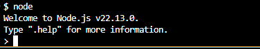
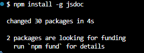
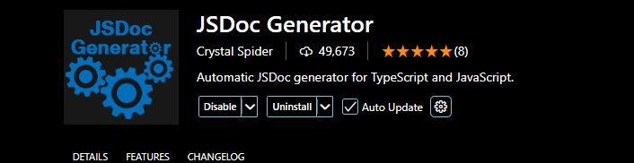
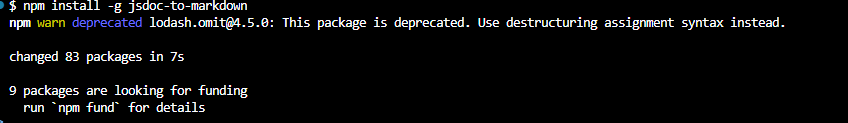
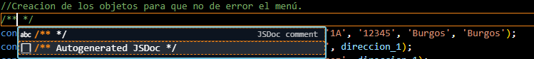
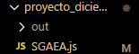

# 1 Instalación de Node y extensiones

## 1.1 Instalación de Node
El primer paso para ejectuar scripts de JavaScript será descargar una aplicación de escritorio llamada Node Js desde su dirección web : 
 https://nodejs.org/es

Una vez descargada se debe ejectuar y seguir los pasos de la instalación y si se tenia abierto Visual Studio cerrarlo para que se pueda ejecutar.

Para comrpobar que Node se ha instalado correctamente escribiendo en la consola (control+ñ) escribiendo 

`node`

Si se ha instalado correcamente saldrá el siguiente mensaje:

## 1.2 Instalación de JsDoc

Una vez que se tine Node implementado, se va a proceder a descargar JsDoc. Para ello en la consola de comandos se  escribirá el siguiente comando: 

`npm install -g jsdoc`

Debe salir este mensaje por consola:

## 1.3 Instalación de JSDoc Generator

Una vez instados ambas extensiones, se va a recurrir a una extension muy util que permite generar codigo jsdoc para
no tener que escribirlo a mano, esta extensión se llama JSDoc Generator

## 1.4 Instalacion de JS to Markdown

Finalmente, se va proceder a descargar una extensión que permite transformar todo el código JsDoc que se genere a Markdown
la extensión se llama JsDoc to Markdown y se puede obtener desde el siguiente enlace:  https://www.npmjs.com/package/jsdoc-to-markdown

Solo se deberá instalar de nuevo con el siguiente comando: 

`npm run -g jsdoc-to-markdown`

Debe salira esto por consola :

# 2 Generar JSDoc y JSDoc to Markdown

## 2.1 Generar JSDoc
Una vez finalizadas las descargas de extensiones se procede a documentar el codigo de JS siguiendo incluyendo comentarios, la extensión de JsDoc Generator indicará si se quiere generar documentación automaticamente

Una vez creado todo el comentario que se desee se va crear un archivo vacio que se llame Readme.md o cualquier nombre que se le quiera dar pero que tenga extensión md, esto lo retomaremos posterioremente.

Para generar el codigo Jsdoc se debe ir a la carpeta que contenga los archivos y si debe escribir el siguiente comando

`jsdoc tuArchivo.js`

Se observa que se ha generado una carpeta llamada out en el directorio del archivo

## 2.1 JsDoc to Markdown

Lo interesante ahora es usar la última extensión para transformar ese codigo js a markdown mediante el siguiente comando en la la consola donde se encuentra el archivo

`jsdoc2md tuArchivo.js`

El último paso será añadir lo que ha salido por el terminal y copiarlo dentro del archivo md.

Finalmente, dentro de .gitignore se debe añadir la carpeta out, conservando el archivo md creado
