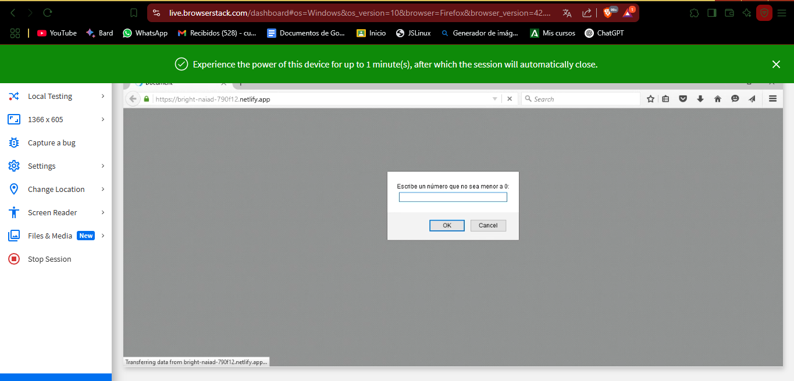

# Configuración de Webpack con Babel

## 1. Inicialización del Proyecto

Inicia el proyecto con Node.js:

```bash
npm init -y
```

Esto generará un archivo de configuración por defecto llamado package.json.

Esto generará un archivo de configuración por defecto llamado `package.json`, en este paquete se irán añadiendo las dependencias que se vayan instalando a lo largo de la interpolación.

Una vez añadido, se procede a descargar las dependencias necesarias. La primera dependencia será descargar Webpack, para ello se debe escribir el siguiente comando por consola

		npm i webpack webpack-cli -D

Esto añadirá las dependencias directamente en el package.json.

Una vez añadido, se debe ir a `package.json`, y dentro de `scripts` se procederá a nombrar el archivo de empaquetación con el nombre que se desee, en este caso se tomará el nombre de `build` al que se le pondrá webpack quedando de tal manera:

````
"scripts": {
    "build": "webpack"
  },
  `````

Una vez hecho esto, se procederá a crear el archivo de configuración de webpack con el siguiente nombre `webpack.config.js`, en el que se irán configurando las 5 configuraciones por defecto del programa.

Para ello, se debe importar el módulo dentro del paquete de configuración creando el siguiente objeto:


````
module.exports{
}
  `````


Y dentro se le debe ir indicando cada punto de configuración, empezando por indicarle dónde encontrar el inicio dentro del objeto mediante `entry:` junto con la ruta donde se encuentre el archivo main.js dentro del proyecto, quedando en este caso así:


````
module.exports{
entry: './tarea 4.4/fuente/js/main.js', 
}
  `````
 

  A continuación se le indicará la salida, para ello se escribirá mediante `output` un objeto al que hay que indicarle un path con un módulo de node con el nombre de la carpeta donde saldrá el archivo y un `filename` con el nombre del archivo `'[name][contenthash].js'`.
  
   Este nombre permitirá a los usuarios cargar datos desde la caché y no se les obligará a usar el último empaquetado que se hubiera hecho, por si hubiera errores. La estructura final debe quedar así:
````
output: {
        path: path.resolve(__dirname, 'dist'),
        filename: '[name][contenthash].js'
'
    }
  `````


Una vez escrito el camino, hay que indicarle al proyecto que se añada la extensión de path que no compile con errores, para ello al inicio del documento y fuera del objeto de configuración se escribirá el siguiente comando

````
const path = require('path');
  `````


La tercera configuración es indicar en `mode` que tipo de configuración se quiere, en este caso produccion de la siguiente manera:
	
	`mode: production`

El penúltimo paso de la configuración será indicarle que extensiones debe recoger para compilar con la siguiente sentencia:

````
resolve: {
        extensions: [".js", ".jsx", ".json"]
    },
  `````
 
Lo último a configurar en este archivo los plugins para dejar limpio index.html que se genere, para ello
hay descargarse en consola los siguientes plugins:

```
npm install clean-webpack-plugin  html-webpack-plugin -D
```

Una vez instalados se debe agregar la configuración dentro de `webpack` de la siguiente manera:
```
plugins: [
    new CleanWebpackPlugin(),
    new HtmlWebpackPlugin({
      template: path.resolve(__dirname, 'html/index.html'),
    }),
  ],
```

El conjunto del codigo se verá así:
```
const path = require('path');
const HtmlWebpackPlugin = require('html-webpack-plugin');
const { CleanWebpackPlugin } = require('clean-webpack-plugin');

module.exports = {
    mode: 'production', // Modo de producción
    entry: path.resolve(__dirname, 'js/main.js'), 
    output: {
        filename: 'bundle.js',
        path: path.resolve(__dirname, 'dist'),
    },
    module: {
        rules: [
            {
                test: /\.js$/,
                exclude: /node_modules/,
                use: {
                    loader: 'babel-loader',
                },
            },
        ],
    },
    plugins: [
        new CleanWebpackPlugin(),
        new HtmlWebpackPlugin({
            template: path.resolve(__dirname, 'html/index.html'), 
        }),
    ],
};
```


## 2. Instalación de Babel y Compilación Final 


Una vez completado esto, se debe de añadir un compilador llamado Babel, que permita interpretar archivos de diferentes maneras, para ello se debe ir a la consola de comandos y escribir lo siguiente:

	`npm install babel-loader @babel/core @babel/preset-env`

Para configurar babel loader se debe crear un archivo json con el siguiente nombre: 

	 babel.config.json.

Dentro del archivo se procede a configurar los “presets” con el archivo instalado anteriormente, en este caso `@babel/preset-env`, quedando de la siguiente manera una vez configurado: 


```javascript
{
    "presets": [
        [
            "@babel/preset-env",
            {
                "corejs": 3.9,
                "useBuiltIns": "usage"
            }
        ]
    ]
}
```

Una vez configurado todo, opr ultimo paso será añadir un listado de navegadores compatibles, para ello en `package.json` debajo de `dependencies` el siguiente comando:

```
"browserslist":["last 100 versions"]
```
El paso final es compilar el archivo con el siguiente comando dentro del directorio donde se encuentra `index.js`:
``` 
npm run build
```
Esto habrá creado una carpeta llamda dist, el paso final será elegir un servidor web en el que se compile como por ejemplo `https://www.netlify.com/` asegurando que sea la carpeta `dist` de donde se recoja el archivo para desplegar.

Al contemplar las últimas versiones, si se selecciona Firefox 41 desde un servicio web `browserstack.com` debería salir compatibilidad, como se muestra a continuación:





